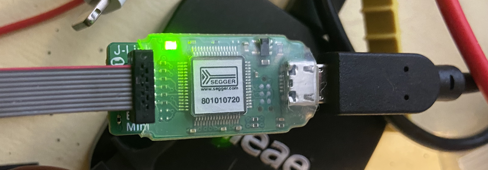
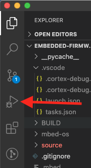

# Environment Setup

## Prerequisites:

1. Git installed on your computer: 

    [Git - Installing Git](https://git-scm.com/book/en/v2/Getting-Started-Installing-Git)

2. VS Code (if using vscode—feel free to use your preferred IDE)

    [Visual Studio Code - Code Editing. Redefined](https://code.visualstudio.com/)

3. Mbed CLI (and its dependencies): 

    [Overview - Build tools | Mbed OS 6 Documentation](https://os.mbed.com/docs/mbed-os/v6.3/build-tools/index.html)

4. GNU Arm Embedded Toolchain (this is a dependency of mbed cli, but putting the download page here for convenience). Make sure to either put this on your path, or point mbed to the directory.

    [GNU Toolchain | GNU Arm Embedded Toolchain Downloads - Arm Developer](https://developer.arm.com/tools-and-software/open-source-software/developer-tools/gnu-toolchain/gnu-rm/downloads)

5. Required Hardware:
    - Smart PPE board
    - JLINK debugger (e.g. [J-Link EDU Mini](https://www.adafruit.com/product/3571?gclid=EAIaIQobChMIqeXO9fvS7QIVEI3ICh3I5g0TEAQYAiABEgJDwvD_BwE), which we have a lot of in the lab). Note that you can also use a Nordic (or I think even ST) development kit in a pinch, but the dedicated J-Link will be faster.
    - Micro USB Cable
    - 7.9mm (W) x 5.4mm (H) Silver Oxide Battery (or dedicated power supply)

## Mbed Project Setup

Here we get up and running with the base project. This ensures we're all able to build the code, flash, and debug our development kits.

1. Clone this repo to a folder on your computer:

    ```bash
    git clone https://gitlab.com/ka-moamoa/smart-ppe/embedded-firmware.git
    ```

2. Shift terminal focus to the `embedded-firmware` directory:

    ```bash
    cd embedded-firmware/
    ```

3. Initialize the mbed repo. Mbed projects store the version of mbed they're using in the `mbed-os.lib` folder (actually just a url containing a commit hash). This is so that you don't have to upload/download the entire mbed library whenever you pull from/push to the repo. The following command finds that url and clones the repository to a new folder `mbed-os`. 

    ```bash
    mbed deploy
    ```

4. I'm not sure if this step is required for Windows computer (or other Mac users, for that matter), but the first time I set this up I had to cd into the `mbed-os` directory and run `pip install -r requirements.txt --user`. I think the `--user` flag should only apply to Macs. `cd ..` back out into the root of the project if you do this.
5. Now you should be able to run `mbed compile -t GCC_ARM -m NRF52_DK` and watch as your computer compiles the code!

## Visual Studio Code Setup

1. IF you're using VS Code, first open up the folder `embedded firmware` in VS Code. On Windows you can do this by right clicking in the folder and selecting "Open in VS Code" (if you enabled that option) and on Mac you can do it by dragging the folder to the icon. There are other ways to do this too (like typing `code .` in your terminal program), but you may have to set them up. Read the docs if interested.
2. Then hit `F1` to bring up the command palette. Start typing `configure default build task`, then select it from the list. It will give you some default options, hit `other`. Paste this into the `tasks.json` file that pops up:

    ```json
    {
        // See https://go.microsoft.com/fwlink/?LinkId=733558
        // for the documentation about the tasks.json format
        "version": "2.0.0",
        "tasks": [
            {
                "label": "build-debug",
                "type": "shell",
                "command": "mbed compile -t GCC_ARM -m SMARTPPE --profile mbed-os/tools/profiles/debug.json",
                "problemMatcher": "$gcc",
                "group": {
                    "kind": "build",
                    "isDefault": true
                }
            },
            {
                "label": "build",
                "type": "shell",
                "command": "mbed compile -t GCC_ARM -m SMARTPPE",
                "problemMatcher": "$gcc",
                "group": "build"
            }
        ]
    }
    ```

3. Now you can build right in vscode. You can kick it off by pressing `F1` then `Tasks: Run Build Task`, or you can kick it off with a key command (I think the default is cmd-shift-B on mac and ctrl-shift-b on windows, but you can change this). Key commands are the way to go IMO.

## Flashing and Debuggin The Board with Ozone (Recommended)

Unfortunately in my experience the best debugger for Nordic chips (Ozone) is not the same as the best coding environment for Nordic chips (VSCode). That means that I usually code and build in VSCode, and then switch to Ozone when it's time to debug. Thankfully, Ozone makes this process relatively painless. Here's how to set it up:

1. Plug in the J-Link (or dev kit) to your computer via USB, connect the ribbon cable to the smart ppe board's debug header. The red wire on the ribbon should be on the side of the J-Link marked with a (1). 
2. Download [Ozone](https://www.segger.com/products/development-tools/ozone-j-link-debugger/#download-installation)
3. Open it up, select `Create New Project`
4. Use the following Target Device settings: 
    - Device: `nRF52832_xxAA`
    - Register Set: `Cortex-M4 (with FPU)`
    - Peripherals: I placed a file `nrf52.svd` in the repository. Put in your system's pathname to this file. (e.g. `/Users/alex/google-drive/hester-lab/Projects/smart ppe/embedded-firmware/nrf52.svd`)
5. Hit next, then use these Connection Settings:
    - Target Interface: `SWD`
    - Target Interface Speed: `8 MHz`
    - Host Interface: `USB`
    - Serial No: (this should auto-populate with your connected j-link device's serial number, leave it as is)
6. Hit next, and enter your systems's pathname to the .elf file. From the base directory of the repo, the path is: `embedded-firmware/BUILD/SMARTPPE/GCC_ARM-DEBUG/embedded-firmware.elf` Note that this only exists if you have already successfully built the software from VSCode!
7. Hit Finish, you should see `main.cpp` up on the screen. 
8. Hit the green power button in the upper left corner of the screen. If your smart PPE board is powered, Ozone should connect and download the program to it. 
9. One more step before you run the program. In the menu bar, select Tools->Trace Settings. Under Trace Source, select `SWO`. Hit `Save to Project`. This enables SWO printf, which is what we're using to log messages from the board. Any SWO messages will show up in the "Terminal" window. I think it shows by default, but if not you can see it by selecting View->Terminal from the menu bar.
10. You should save this debug configuration to your project folder by hitting File->Save Project As. The .gitignore should ignore any ozone files so feel free to name it whatever you want. 
11. Now you can debug as usual. Whenever you rebuild the code, Ozone will automatically detect that the .elf file has changed and, when you switch focus back to Ozone, will ask if you want to reload it. I usually select the `Do not show again` checkbox and hit `Yes`. This way, Ozone will automatically flash and reset the board when it detects a change to the .elf file.
12. Random tips:
    - You can find a source file by clicking into the `Source Files` window and begin typing the name of the source file. It will search for and show the file. Handy if you want to set breakpoints in a given file.
    - Same goes for the `Registers` window. Expand the bank you're interested in (likely Peripherals with 1708 registers, which we get from the nrf52.svd file), and then begin typing the name of the register you're interested in. 

## Flashing The Board (VSCode)

You can also flash/debug the board with VSCode, but in my experience it's clunkier than Ozone. I also don't think you can get a view of the registers. But feel free to experiment if interested!

You have to download the [nrf command line tools](https://www.nordicsemi.com/Software-and-tools/Development-Tools/nRF-Command-Line-Tools/Download#infotabs) for this part (and the next part). Make sure they are added to your path variable.

Add this task to your `tasks.json` file:

```json
        {
            "label": "flash",
            "type": "shell",
            "command": "mbed compile -t GCC_ARM -m NRF52_DK && nrfjprog -f nrf52 --eraseall && nrfjprog -f nrf52 --program \"${workspaceRoot}/BUILD/NRF52_DK/GCC_ARM/${workspaceRootFolderName}.hex\" && nrfjprog -f nrf52 --reset",
            "problemMatcher": []
        }
```
A note on these ^, the `command`s have to point to *your* executable. After the `nrf52 --program` argument, you may have to modify the path if your computer doesn't build the files to the location I've specified here. I think it should, but it may depend on something computer-dependent.

Once that's in there, you should be able to hit `F1`->`Tasks: Run Task`->`flash`, and compile/flash the program to your board!

## Debugging The Board (VSCode)

Make sure you have the [nrf command line tools](https://www.nordicsemi.com/Software-and-tools/Development-Tools/nRF-Command-Line-Tools/Download#infotabs) I talked about in the last section (and on your path!)

Add this task to your `tasks.json` file:

```json
        {
            "label": "flash-debug",
            "type": "shell",
            "command": "mbed compile -t GCC_ARM -m NRF52_DK --profile mbed-os/tools/profiles/debug.json && nrfjprog -f nrf52 --eraseall && nrfjprog -f nrf52 --program \"${workspaceRoot}/BUILD/NRF52_DK/GCC_ARM/${workspaceRootFolderName}.hex\" && nrfjprog -f nrf52 --reset",
            "problemMatcher": []
        },
```

This is a modified version of the `flash` task you added in the last section. It compiles and flashes a "debuggable" (non-optimized) version of the code using the `--profile mbed-os/tools/profiles/debug.json` argument.

Now, hit the "Run" button on your sidebar  
  
and select "create a launch.json file". Choose any of the options (you'll delete the default configuration it adds).

Copy/paste this over the launch.json file that is generated:

```json
{
    // Use IntelliSense to learn about possible attributes.
    // Hover to view descriptions of existing attributes.
    // For more information, visit: https://go.microsoft.com/fwlink/?linkid=830387
    "version": "0.2.0",
    "configurations": [
        {
            "name": "Cortex - OpenOCD",
            "cwd": "${workspaceRoot}",
            "executable": "\"${workspaceRoot}/BUILD/NRF52_DK/GCC_ARM/${workspaceRootFolderName}.elf\"",
            "request": "launch",
            "type": "cortex-debug",
            "servertype": "openocd",
            "runToMain":true,
            "interface":"jtag",
            "configFiles": [
                "board/nordic_nrf52_dk.cfg"
            ],
            "armToolchainPath": "/Applications/ARM/bin",
            "preLaunchTask": "flash-debug"
        }
    ]
}
```

Save, and now you should be able to debug your board from within VS Code by hitting the "run" button, and clicking the green arrow at the top of the panel. (Or, as with all things, you can set up a keyboard shortcut to do this).

